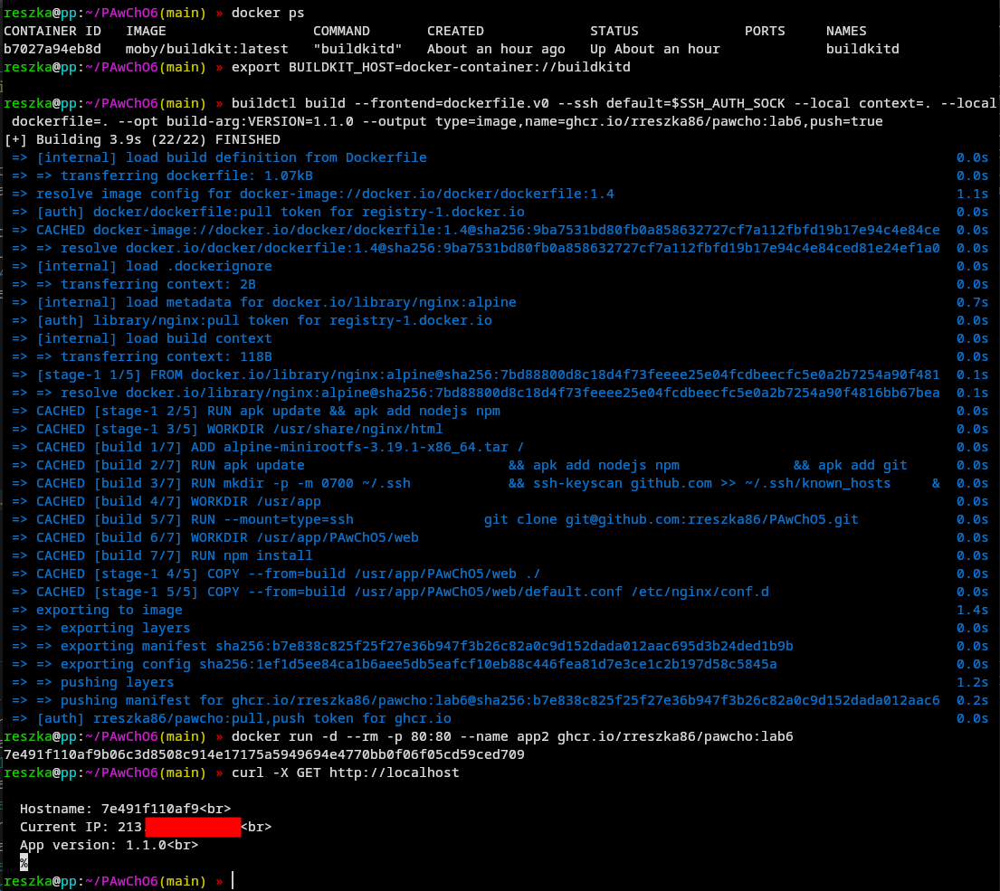

# LAB6 - ghcr.io usage and creating an extended Dockerfile frontend

Solution for this lab is based on the one presented in previous repository. For further information check [PAwChO - LAB5](https://github.com/rreszka86/PAwChO5).

## Explanation

The major changes to this Dockerfile are to change the way it delivers web app files in the building process. Now they are cloned from previous repository instead of being copied from host machine.
To make it possible, I had to install GIT and OpenSSH client packages in the first build stage. Then a directory used by SSH client was created and the ssh-keyscan command was invoked. The result of the second command are GitHub public keys, which are written to the known_hosts file. It's a security measure to prevent MITM attacks.
Now I can continue by cloning the repo from previous lab and use it files to build a web app.

## Building an image

In this lab, the task is to use BuildKit with buildctl client instead of tool provided by default with Docker ecosystem (which is also a wrapper for BuildKit). To make it possible, BuildKit daemon is needed.

### Providing BuildKit daemon in a container

```sh
docker run -d --rm --name buildkitd --privileged moby/buildkit:latest
```

Now we need to indicate the default host for building an image.

```sh
export BUILDKIT_HOST=docker-container://buildkitd
```

### Providing Linux image for building process

As in the previous repository, I include a link to download the Alpine Linux image.

```sh
curl -L -o alpine-minirootfs-3.19.1-x86_64.tar https://dl-cdn.alpinelinux.org/alpine/v3.19/releases/x86_64/alpine-minirootfs-3.19.1-x86_64.tar.gz
```

### Building an image with buildctl

```sh
buildctl build --frontend=dockerfile.v0 --ssh default=$SSH_AUTH_SOCK --local context=. --local dockerfile=. --opt build-arg:VERSION=1.1.0 --output type=image,name=ghcr.io/rreszka86/pawcho:lab6,push=true
```

If there won't be *--opt* option with value provided for VERSION argument, then it will be described as *test_build*.

That solution assumes that we have configured authorization on host machine to access GitHub services with usage of SSH keys. If there is any problem with variable *$SSH_AUTH_SOCK*, running this command might help (it should launch the ssh-agent process):

```sh
eval "$(ssh-agent -s)"
```

### Creating and starting a container

```sh
docker run -d --rm -p 80:80 --name app2 ghcr.io/rreszka86/pawcho:lab6
```

## But does it even work?



